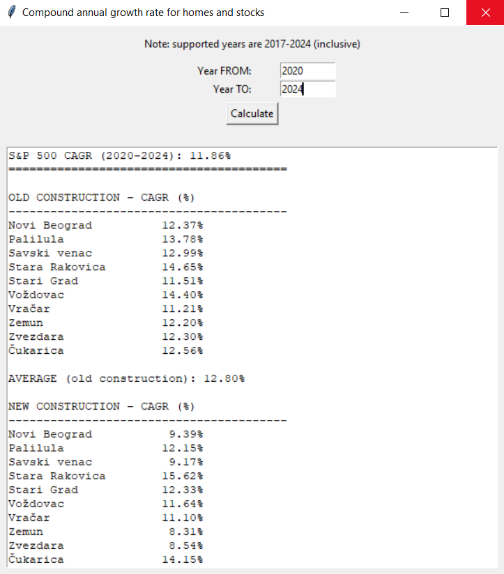

# Home and stock price CAGR calculator

## Description
A program for calculating and comparing the growth rate
of stocks with the growth rate of prices of homes in Belgrade.

It compares the CAGR (Compound Annual Growth Rate)
for stocks and home values, for the given years.




## What data it uses

For the stock prices, the data was extracted from
yahoo finance for GSPC, which is tracking the s&p 500 index.

For the home prices in Belgrade, the data was taken from [RGZ](https://www.rgz.gov.rs/%D0%B8%D0%B7%D0%B2%D0%B5%D1%88%D1%82%D0%B0%D1%98%D0%B8-%D0%B7%D0%B0-%D0%BF%D1%80%D0%BE%D1%84%D0%B5%D1%81%D0%B8%D0%BE%D0%BD%D0%B0%D0%BB%D0%BD%D0%B5-%D0%BA%D0%BE%D1%80%D0%B8%D1%81%D0%BD%D0%B8%D0%BA%D0%B5) 
(Republicki geodetski zavod).  
The data is in the public yearly reports and the data is written in the program.  
The home prices in the reports is grouped by municipality.  
For the calculation of CAGR, the average price per square meter was taken as the data.    
CAGR is calculated for each municipality and for Belgrade on average.  

This method does not represent actual CAGR, as it overlooks many different factors.  
Nonetheless, the method and calculations shows a rough estimation of price growth of prices over time.

**Note: The data for home prices is avalilable from 2017 to 2024 (inclusive).   
Years outside that range will result in no data being displayed.**

## How to run it

It is recommended to use a virtual environment (`venv`) to isolate the project dependencies from the system Python.  

### Windows

1. Create a virtual environment:
```bash
python -m venv venv
```
2. Activate the virtual environment:

**Command Prompt:**
```bash
venv\Scripts\activate
```

**PowerShell:**

```bash
venv\Scripts\Activate.ps1
```

3. **Install the required libraries:**

```bash
pip install -r requirements.txt
```

### Linux / macOS
1. Create a virtual environment:

```bash
python3 -m venv venv
```

2. Activate the virtual environment:

```bash
source venv/bin/activate
```
3. Install the required libraries:

```bash
pip install -r requirements.txt
```

## Running the Project

After activating the virtual environment and installing dependencies, run the following command:

```bash
python main.py
```

Note: On Linux/macOS, you may need to use python3 main.py.